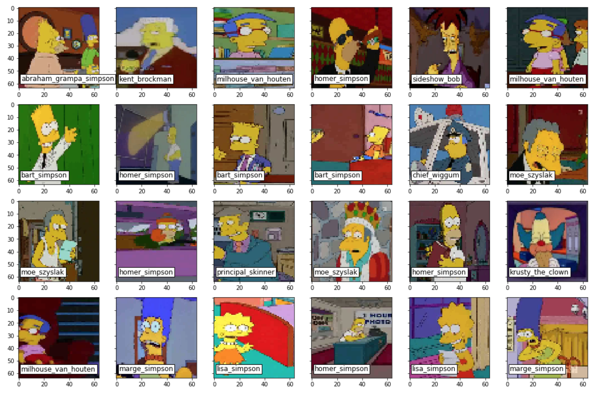

# Deep Learning Course

## Постановка задачи

Пусть  — множество изображений,  — множество наименований классов. 
Существует неизвестная целевая зависимость — отображение , значения которой известны только 
на объектах конечной обучающей выборки . 
Требуется построить алгоритм , способный классифицировать
произвольный объект .

В рамках данного курса ставится задача классификации [персонажей из мультсериала Simpsons](https://www.kaggle.com/alexattia/the-simpsons-characters-dataset)

## Описание датасета

Датасет состоит из двух частей - обучающей и тестовой выборки. 

Обучающая выборка содержит 18 классов / персонажей (данные по Kaggle содержат 20 классов, 
но в настоящее время мы использовали только 18 персонажений для обучения).

|    | name                     | total |
|----|--------------------------|-------|
| 0  | Homer Simpson            | 2246  |
| 1  | Ned Flanders             | 1454  |
| 2  | Moe Szyslak              | 1452  |
| 3  | Lisa Simpson             | 1354  |
| 4  | Bart Simpson             | 1342  |
| 5  | Marge Simpson            | 1291  |
| 6  | Krusty The Clown         | 1206  |
| 7  | Principal Skinner        | 1194  |
| 8  | Charles Montgomery Burns | 1193  |
| 9  | Milhouse Van Houten      | 1079  |
| 10 | Chief Wiggum             | 986   |
| 11 | Abraham Grampa Simpson   | 913   |
| 12 | Sideshow Bob             | 877   |
| 13 | Apu Nahasapeemapetilon   | 623   |
| 14 | Kent Brockman            | 498   |
| 15 | Comic Book Guy           | 469   |
| 16 | Edna Krabappel           | 457   |
| 17 | Nelson Muntz             | 358   |

Тестовая выборка включает в себя по 50 примеров каждого класса.

## Метрики качества

В качестве метрики качества используем accuracy.

## Исходный формат хранения данных

Обучающая выборка состоит из изображений в формате BGR, разделенных на папки, название которых обозначает имя персонажа.
Каждое изображение имеет разный размер.

## Подготовка входных данных

Подготовка изображений включала в себя следующие действия: 
1. Переход в формат RGB
2. Приведение изображений к одному размеру (напр. 64х64)

Так как загрузка всех изображений выборки является затратной по памяти операцией,
для передачи входных данных в модели использовались генераторы, которые случайным образом достают
batch_size изображений из изначальной структуры директорий.

Так же для исскуственного увеличения исходной выборки будем использовать 
аутментацию - каждое изображение может быть видоизменено для создания новых экземпляров. 
Под видоизменением могут подразумеваться сдвиги, повороты, зеркальные отражения и прочее. 
В библиотеке Keras для аугментации существует класс ImageDataGenerator.

## Полученные результаты
|Model|Test accuracy|
|-|-|
|Best MLP |0.473|
|Best MLP with autoencoder|0.492|
|Best CNN |0.88|
|Best CNN with autoencoder|0.93|
|VGG-16|0.95|
|VGG-16 + XGBoost|0.94|
|Pre-trained VGG-16 + new Dense|0.997|
