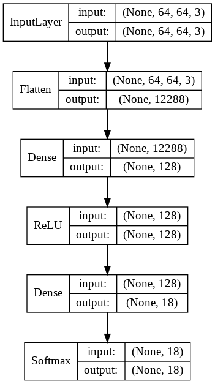
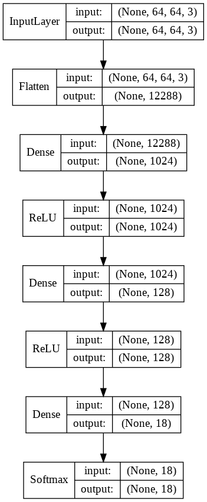
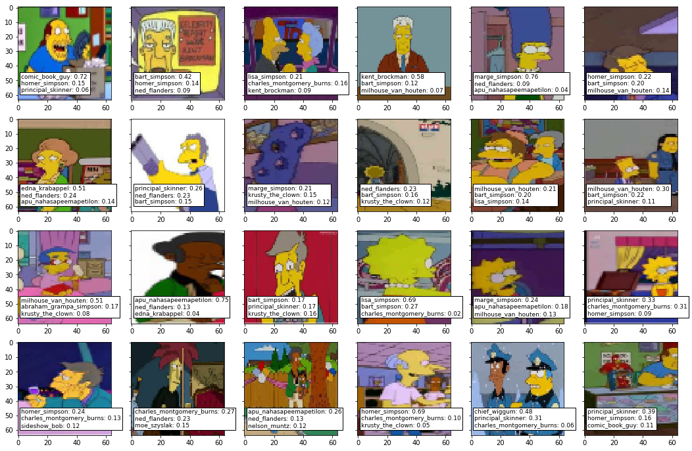

# FCNN

## [Intro](../README.md)

## Разработанные скрипты

Вся проведенная работа в пошаговом виде содержится в Jupiter-ноутбуке [lab1.ipynb](./lab1.ipynb).
Файл включает в себя:
* Подготовку данных
* Создание моделей
* Обучение моделей
* Визуализацию каждого шага

## Конфигурации моделей

В данной работе были проведены эксперементы с тремя моделями: 

1. Baseline model

      
    
    

2. Improved model

    
    
    
    
3. Custom model

    
    
    Рассматривались конфигурации нейронной сети при параметрах:
    
    
    
    Пример модели:

    
    
    
    
## Результаты экспериментов

| Model                                      | time (sec) | training accuracy | validate accuracy | test accuracy |
|--------------------------------------------|------------|-------------------|-------------------|---------------|
| Baseline model                             | 738.15     | 0.488             | 0.442             | 0.439         |
| Improved model                             | 998.92     | 0.515             | 0.426             | 0.442         |
| Best of custom model (s=512, act='relu')   | 842.86     | 0.495             | 0.480             | 0.473         |

Лучшие результаты на тестовой выборке продемонстрировала custom model с параметрами s=512, act='relu' - *0.473*.

Визуализация предсказания лучшей модели (по топ-3):

