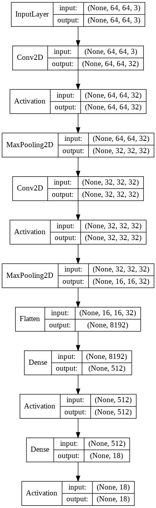

# CNN

## [Intro](../README.md)

## Разработанные скрипты

## Конфигурации моделей

В данной работе были произведены эксперементы с различными вариантами параметризированной модели:

| Параметр модели | Значение параметра | Возможные значения |
|-----------------|--------------------|--------------------|
| n_conv          |                    | 32, 64             |
| l2_reg          |                    | 0, 0.5             |
| n_layers        |                    | 2, 3               |

Пример модели с n_conv=32, l2_reg=0, n_layers=2: 

## Результаты экспериментов