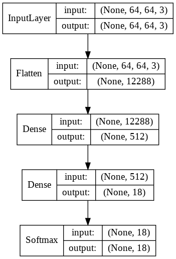
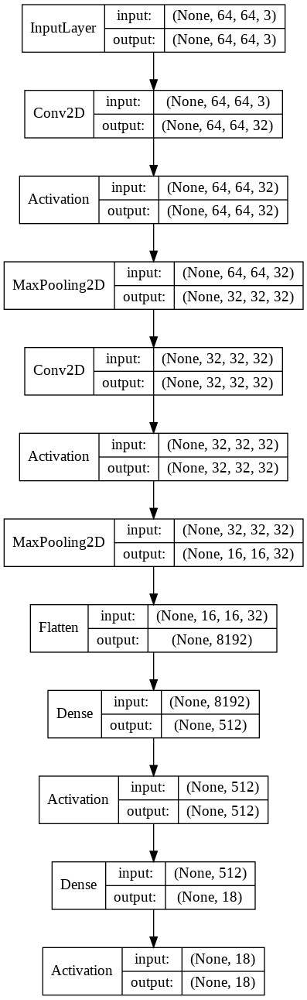
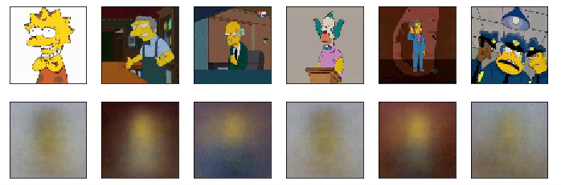
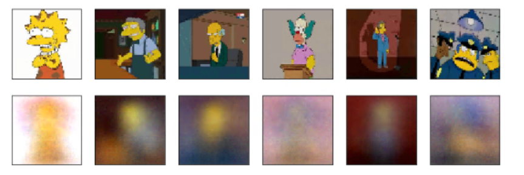

# Лабораторная №3. Начальная настройка весов полностью связанных и сверточных нейронных сетей

## Постановка задачи на лабораторную работу
Выполнение лабораторной работы предполагает решение следующих задач:
1. Выбор архитектур нейронных сетей, построенных при выполнении предшествующих
практических работ.
2. Выбор методов обучения без учителя для выполнения настройки начальных значений весов
сетей.
3. Применение методов обучения без учителя к выбранному набору сетей.
4. Сбор результатов экспериментов.

## Описание датасета
[Описание](../README.md)

## Разработанные скрипты

Вся проведенная работа в пошаговом виде содержится в Jupiter-ноутбуке [lab3.ipynb](./lab3.ipynb).
Файл включает в себя:
* Подготовку данных
* Создание моделей
* Обучение моделей
* Визуализацию каждого шага

## Конфигурации моделей
Для наших эксперементов будем использовать 2 архитектуры нейронных сети:
1) MLP, который показал наилучший accuracy из лабораторной №1:

2) CNN, которая показала наилучший accuracy из лабораторной работы №2:

## Работа автокодировщика
В качестве алгоритма без учителя для инициализации начальных весов сети - выберем автокодировщик.

Чаще всего автокодировщики применяют каскадно для обучения глубоких (многослойных) сетей. Автокодировщики применяют для предварительного обучения глубокой сети без учителя. Для этого слои обучаются друг за другом, начиная с первых. К каждому новому необученному слою на время обучения подключается дополнительный выходной слой, дополняющий сеть до архитектуры автокодировщика, после чего на вход сети подается набор данных для обучения. Веса необученного слоя и дополнительного слоя автокодировщика обучаются при помощи метода обратного распространения ошибки. Затем слой автокодировщика отключается и создается новый, соответствующий следующему необученному слою сети. На вход сети снова подается тот же набор данных, обученные первые слои сети остаются без изменений и работают в качестве входных для очередного обучаемого автокодировщика слоя. Так обучение продолжается для всех слоев сети за исключением последних. Последние слои сети обычно обучаются без использования автокодировщика при помощи того же метода обратного распространения ошибки и на маркированных данных (обучение с учителем).

## Ход работы

Для обучения автокодировщика будем использовать как тренинговую, валидационную и тестовую подвыборку. Т.к. лейблы нам все равно не нужны.

### MLP

Для обучения авкодировщика будем брать каждый слой (и все до него), дополнять до автокодировщика и делать обучение на всех данных. И так последовательно для каждого слоя.

Давайте переделаем исходную MLP модель в автокодировщик. Для этого мы заменим последний слой (у нас только один скрытый слой) размерностью исходного изображения и в качестве X и Y для обучения нейронной сети будем использовать одни и теже исходные картинки.

Давайте посмотрим результат работы автокодировщика сетей:

Видим, что он получает очень картинку, но в целом силуэт и фон просматриваются.

Теперь, после того, как мы обучили автокодировщик - мы используем полученные веса для тренировки модели, которая уже решает исходную задачу классификации.

Сравним получившиеся результаты классификации с автокодировщиком и без:

| Model  | Time | Test accuracy |
|--------|------|-------------------|
|MLP w/ default initialization|150s|0.475|
|MLP w/ autoencoder|150s|0.492|

### CNN:

Для CNN - отрежем из исходной сети последний Dense слой и дополним сеть до автокодировщика, как указано в гайде [Keras](https://blog.keras.io/building-autoencoders-in-keras.html) c использованием UpSampling2D слоев. 

Результат работы автокодировщика:

Результаты исходной CNN с использованием инициализации с помощью автокодировщика.

| Model  | Time | Test accuracy |
|--------|------|-------------------|
|CNN w/ default initialization|321s|0.89|
|CNN w/ autoencoder|321s|0.93|

## Полученные результаты

Видим, автокодировщик помогает улучшить точность предсказания.
Время тренировки остается таким же, потому что мы имеем одну и туже архитектуру и количество эпох в обоих случаях.
