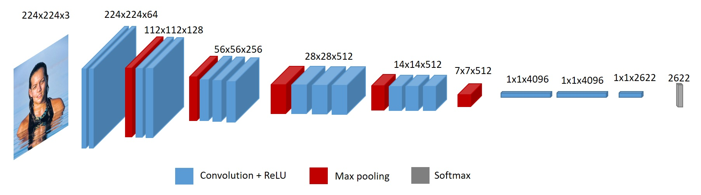

# Применение переноса обучения для решения задачи

## [Intro](../README.md)

## Разработанные скрипты

Вся проведенная работа в пошаговом виде содержится в Jupiter-ноутбуке [lab4.ipynb](./lab4.ipynb).
Файл включает в себя:
* Подготовку данных
* Создание моделей
* Обучение моделей
* Визуализацию каждого шага

## Конфигурации моделей

### Исходная модель

В качестве исходной модели для переноса обучения использовали архитектуру **VGG-Very-Deep-16** CNN на задаче [VGG-Face](https://www.robots.ox.ac.uk/~vgg/data/vgg_face/), которая является немного близкой к нашей. В ней тоже определяются конкретные персонажи на изображении. Сам датасет имеет 2.6 млн изображений для предсказывания 2622 людей.

Архитектура сети VGG16 для исходной задачи выглядит следующим образом:

В качестве готовой модели, `Keras` не имеет исходную задачу. Поэтому возьмем её отсюда [keras-vggface](https://github.com/Tony607/keras_vggface). Используем построенную модель и обученные параметры на задаче VGG-Face.

### Использование структуры исходной модели для решения нашей задачи

Первый эксперимент состоит в использовании **только** структуры модели. Чтобы применить непосредственно к нашей задаче заменим в последнем слое количество выходов 2622 -> 18. И обучим на случайно сгенерированных весах (с помощью, например `he_uniform`) исходную модель для целевой задачи.

С помощью такого подхода мы получили **0.95** аккураси на тестовой выборке.

Визуализация предсказания данной модели (топ-3):

### Использование признакового пространства исходной задачи для решения целевой задачи

Второй эксперимент состоит в использовании признакового пространства всех конволюционных слоёв исходной модели при обученных на исходной задачи весов.

В качестве "головы" мы можем использовать любой классификатор, решающий задачу на новом признаковом пространстве.

Мы пробывали использовать в качестве классификаторов линейные модели - Логистическую регрессию, полносвязанные слои и леса - XGBoost. Лучше всего обработал **XGBoost**. Поэтому в качестве результирующей модели возьмем именно его.

С помощью такого подхода мы получили **0.94** аккураси на тестовой выборке.

Визуализация предсказания данной модели (топ-3):

### Использование параметров исходной модели для решения целевой задачи

Возьмем веса из исходной задачи и используем их для нашей задачи в качестве начальных. Заменим "голову" исходной задачи на новую "голову", веса которой будут распределены случайно (с помощью `he_uniform`).

Обновленная архитектура выглядит следующим образом:

С помощью такого подхода мы получили **0.99** аккураси на тестовой выборке.

Визуализация предсказания данной модели (топ-3):

## Результаты экспериментов

| Model  | time | training accuracy |  test accuracy |
|--------|------|-------------------|----------------|
|Структура исходной модели. Обучение с нуля         | 3h 37min             | 0.95     | 0.95       |
|Признаковое пространство исходной модели + XGBoost | 8min 42s + 7min 37s  | 1.0      | 0.94       |
|Параметры исходной модели + "голова"               | 4h 17min             | 0.999    | 0.997      |

Самой лучшей моделью получился третий эксперимент - использования готовых весов в качестве инициализации. Получили очень хорошую точность предсказания. Вероятно мы подобрали, действительно схожую задачу с подходящей архитектурой.
